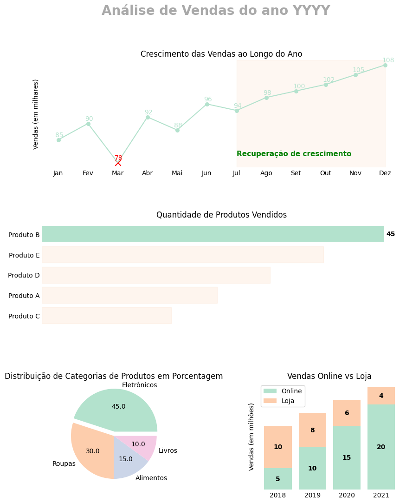

# Matplotlib na prática

- [Visão Geral](#visão-geral)
- [O Matplotlib](#o-matplotlib)
  - [Os Gráficos](#os-gráficos)
- [O Projeto](#o-projeto)
- [Sobre Mim](#sobre-mim)

## Visão Geral 

Este é um projeto com foco no matplotlib. O objetivo foi aproveitar da vasta complexidade e utilidades da biblioteca para fazer uma análise de dados. 

## O Matplotlib

O [Matplotlib](https://matplotlib.org/stable/index.html) é uma biblioteca do Python com foco em criação de gráficos e visualização de dados. 

O matplotlib oferece uma interface de progamação orientada a objetos.

### Os Gráficos

É possível plotar uma infinidade de gráficos que vão desde simples [gráficos de linha](https://matplotlib.org/stable/plot_types/basic/plot.html#sphx-glr-plot-types-basic-plot-py) até [gráficos complexos em 3D](https://matplotlib.org/stable/plot_types/3D/index.html) com estilos totalmente costumizáveis.

## O Projeto

Este projeto foi construído utilizando o Jupyter Notebook. Os dados utilizados são fictícios, portanto a análise e gráficos retornados também são fictícios e, obviamene, podem ser adaptados para situações reais.

Utilizando o modelo de eixos, figura e mosaico do Matplotlib, o resultado final deve ser este:

## Sobre Mim

- E-mail: alessandra_santos_oliveira@hotmail.com
- LinkedIn - [Alessandra Oliveira](https://www.linkedin.com/in/alessandra-santos-oliveira/)
- Twitter - [@itsale_o](https://www.twitter.com/itsale_o)

